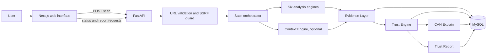

# CAN System Architecture

This document records the Phase 1 architecture from the CAN competition proposal. It is a design baseline, not a claim that the described analysis features are already implemented.

## Product Boundary

CAN is an interpretation layer that explains observable evidence about a website. It does not replace antivirus, browser security, or threat-intelligence services, and it must not claim that a website is absolutely safe or malicious.

The competition MVP is:

1. Landing Page
2. CAN Scan
3. Trust Report
4. Trust DNA
5. CAN Explain

Trust Gap, CAN Network, CAN Data, CAN Report, CAN History, CAN Academy, and CAN Watch are stretch goals. The proposal discusses Trust Gap in its solution flow, but lists it as a stretch goal, so it is not part of the initial MVP implementation.

## Components

- **CAN Web Interface**: Next.js, React, and Tailwind CSS. The existing app remains at the repository root.
- **API / Backend**: FastAPI receives scan requests, coordinates checks, and serves status and reports.
- **Analysis Engine**: six sub-engines map to Security, Authenticity, Transparency, Behavior, Network, and Data Exposure.
- **Context Engine**: optional supporting context, such as a site sector. It is not a seventh Trust DNA dimension and must not invent context when unavailable.
- **Evidence Layer**: records the source, type, status, observation time, and explanation for each collected item.
- **Trust Engine**: applies versioned, explainable rules to observed evidence to produce Trust DNA and, later, Trust Gap.
- **CAN Explain**: renders each finding as What, Why, Evidence, Impact, and Action.
- **Trust Report**: presents the URL, scan ID and time, Trust Confidence, six dimensions, key findings, evidence, and the limitation disclaimer.
- **MySQL**: planned persistence for scans, evidence, dimension scores, and findings. User accounts are not required for the MVP.



## Scan Flow

1. The frontend submits a URL to `POST /api/scan`.
2. The backend normalizes and validates the URL, then applies SSRF protections before any outbound request.
3. The scan coordinator runs only the checks enabled for the selected mode and records the real state of each step.
4. Analysis engines return evidence records. They do not directly write user-facing claims.
5. The Trust Engine applies the active, versioned rules to available evidence.
6. CAN Explain turns supported findings into What / Why / Evidence / Impact / Action content.
7. The report is persisted and made available by scan ID.

For an honest progress display, the scan request should create a scan ID and the frontend should poll a status endpoint. A simple FastAPI background task is sufficient for a single-instance competition MVP; it is not a durable distributed job queue. A production worker can be considered later if needed.

## API Contract

### `POST /api/scan`

Request:

```json
{
  "url": "https://example.com"
}
```

Response proposal (`202 Accepted`):

```json
{
  "scan_id": "<uuid>",
  "status": "queued",
  "mode": "demo"
}
```

### `GET /api/scan/{scan_id}/status`

Returns the current state and completed/current stages. Progress must reflect real checks in real mode. In demo mode, any simulated progression must be explicitly labeled as demonstration.

### `GET /api/report/{scan_id}`

Returns the completed report, or a clear processing / not-found response. The frontend route is `/report/[id]`.

API errors should use stable error codes and user-safe messages. Raw exceptions, internal addresses, and sensitive server details must not be returned.

## Data Model

The initial relational model avoids accounts and stores only what is needed to retrieve and explain a scan:

- `scans`: UUID, submitted/canonical URL, status, mode, start/completion timestamps, rules version, Trust Confidence and evidence coverage.
- `evidence`: scan ID, dimension, source/type, status, observed value or redacted summary, explanation, and collection timestamp.
- `trust_scores`: scan ID, dimension, nullable score, confidence, coverage, and rules version.
- `findings`: scan ID, dimension, severity, confidence, and What / Why / Impact / Action text.
- `finding_evidence`: relation between findings and the evidence records that support them.

Evidence unavailable is not a positive finding. A dimension with too little evidence can have a null score and lower coverage instead of a fabricated score. Trust Confidence describes the coverage and reliability of available evidence, not the probability that a site is safe.

## Real and Demo Modes

`DEMO_MODE=true` selects explicit, version-controlled fixtures. Responses and the UI must show that the result is demonstration data. The same API response schema should serve demo and real providers so the frontend does not need separate implementations.

Real checks should be limited to evidence the backend actually collects, such as DNS resolution, HTTPS/TLS metadata, HTTP status and redirects, security headers, cookie attributes, and externally referenced resources in the initial HTML response. MVP checks must not execute target-site JavaScript, infer intent, or claim to detect all phishing or data exfiltration.

## Security Boundaries

URL scanning is an SSRF-sensitive capability. Before outbound requests:

- Accept only `http` and `https`, and restrict ports to the supported web ports.
- Reject loopback, private, link-local, multicast, reserved, and metadata-service addresses for IPv4 and IPv6.
- Resolve and validate destination addresses, and revalidate every redirect hop. Mitigate DNS rebinding by connecting only to a validated address while preserving the original host for TLS verification.
- Set short connect/read timeouts, a small redirect limit, and response-size limits. Do not forward cookies, authorization headers, or internal credentials to target sites.
- Apply request rate limits and restrict outbound network access at deployment level where possible.
- Configure CORS to the actual frontend origin. Keep secrets in ignored environment files; commit only `.env.example`.

Store the minimum evidence needed for an explainable report. Redact URL credentials and sensitive query values, and define retention before adding persistent scan history.

## Routing Decision

The proposal's public and result routes are the target: `/`, `/scan`, and `/report/[id]`. The existing prototype has `/periksa` routes. Phase 1 does not remove or redirect them; route migration belongs with the frontend phase so existing functionality is not silently discarded.

## Dependency Policy

The current frontend dependencies are retained. The backend requirements list the planned direct packages for the API, HTTP checks, and MySQL access. Cytoscape.js is deferred until CAN Network is approved for implementation. No threat-intelligence API key or external scanner is assumed.